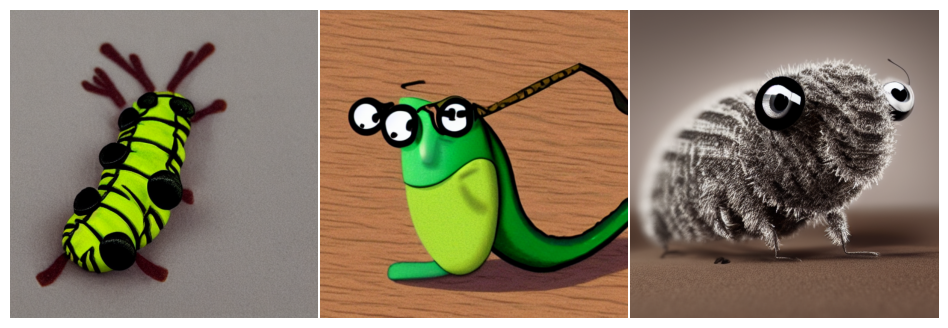
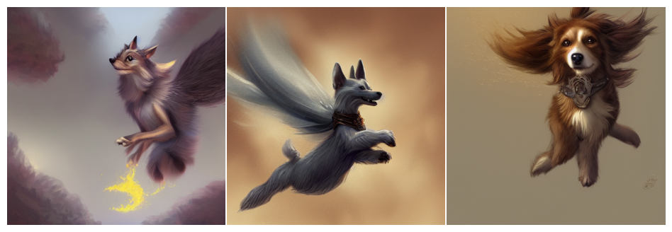
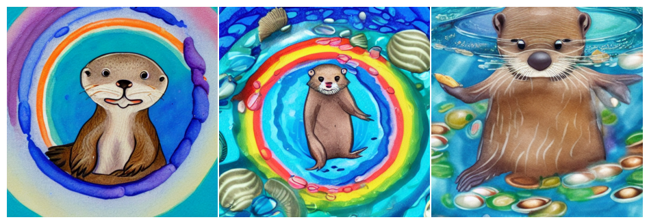
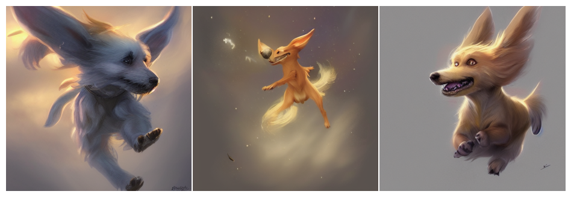
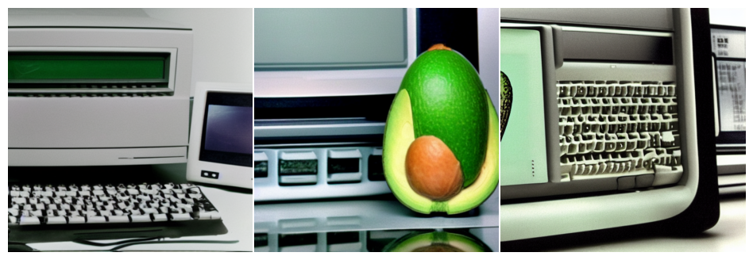
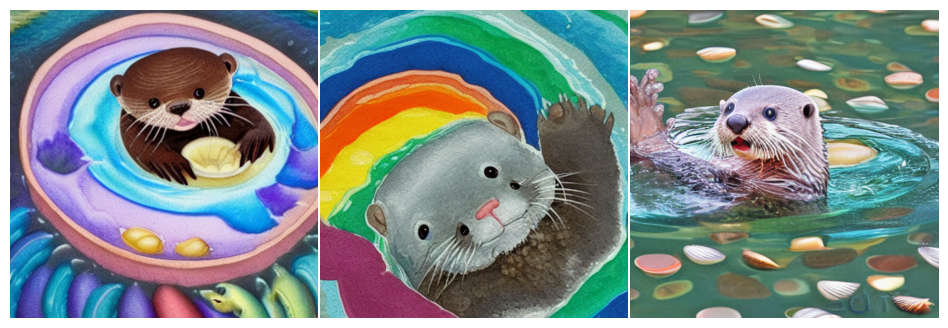
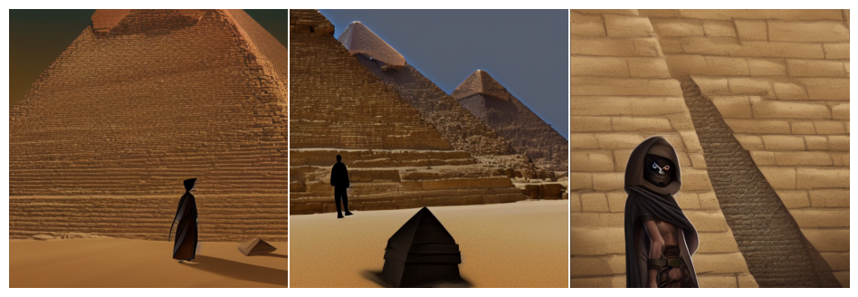

# Generate images using KerasCV's StableDiffusion's at unprecedented speeds

**Author:** [fchollet](https://github.com/fchollet), [lukewood](https://lukewood.xyz), [divamgupta](https://github.com/divamgupta)<br>
**Date created:** 2022/09/24<br>
**Last modified:** 2022/09/24<br>
**Description:** Generate new images using KerasCV's StableDiffusion model.

## Overview

In this guide, we will show how to generate novel images based on a text prompt using
the KerasCV implementation of [stability.ai's](https://stability.ai/) image to text
model,
[StableDiffusion](https://github.com/CompVis/stable-diffusion).

StableDiffusion is a powerful, open-source text to image generation model.  While there
exist numerous open source implementations that allow you to easily create images from
textual prompts, KerasCV's offers a few distinct advantages.
These include [XLA compilation](https://www.tensorflow.org/xla) and
[mixed precision computation](https://www.tensorflow.org/guide/mixed_precision).

In this guide, we will explore KerasCV's StableDiffusion implementation, show how to use
these powerful performance boosts, and explore the performance benefits
that they offer.

To get started, lets install a few dependencies and sort out some imports:


```python
import matplotlib.pyplot as plt
import keras_cv
from luketils import visualization
import tensorflow as tf
from tensorflow import keras
from tensorflow.keras import layers
from tensorflow.keras import mixed_precision
import time
```


## Introduction

Unlike most tutorials, where we first explain a topic then show how to implement it,
with text to image generation it is easiest to show instead of tell.

Check out the power of `keras_cv.models.StableDiffusion()`.
First, we construct a model:


```python
stable_diffusion = keras_cv.models.StableDiffusion(img_width=512, img_height=512)
```


Next, we give it a prompt:


```python
images = stable_diffusion.text_to_image(
    "a cartoon caterpillar wearing glasses", batch_size=3
)

visualization.plot_gallery(
    images,
    rows=1,
    cols=3,
    scale=4,
    value_range=(0, 255),
    show=True,
)
```

    

    


Pretty incredible!

But that's not all this model can do.  Lets try a more complex prompt:


```python

def visualize_prompt(prompt, sd_model=None):
    sd_model = sd_model or stable_diffusion
    visualization.plot_gallery(
        sd_model.text_to_image(prompt, batch_size=3),
        rows=1,
        cols=3,
        scale=4,
        value_range=(0, 255),
        show=True,
    )


visualize_prompt(
    "a cute magical flying dog, fantasy art drawn by disney concept artists, "
    "golden colour, high quality, highly detailed, elegant, sharp focus, "
    "concept art, character concepts, digital painting, mystery, adventure"
)
```

    

    


The possibilities are literally endless (or at least extend to the boundaries of
StableDiffusion's latent manifold).

Pretty incredible!  The idea should be self evident at this point.
Now lets take a step back and look at how this algorithm actually works.

## The StableDiffusion Algorithm

TODO(fchollet): write this


```python
# Need to write up the actual algorithm and provide an overview
```

## Perks of KerasCV

With numerous implementations of StableDiffusion publicly available why shoud you use
`keras_cv.models.StableDiffusion()`?

Aside from the easy-to-use API, KerasCV's StableDiffusion model comes with some nice
bells and trinkets.  These extra features include but are not limited to:

- out of the box support for XLA compilation
- support for mixed precision computation out of the box

When these are combined, the KerasCV StableDiffusion model runs orders of magnitude
faster than naive implementations.  This section shows how to enable all of these
features, and the resulting performance gain yielded from using them.

For the purposes of comparison, I ran some benchmarks with the
[HuggingFace diffusers](https://github.com/huggingface/diffusers) implementation of
StableDiffusion on an A100 GPU it took around 12.8 seconds to generate three images.
The runtime results from running this guide may vary, in my testing the KerasCV
implementation of StableDiffusion is significantly faster than the PyTorch counterpart.
This may be largely attributed to XLA compilation.

**Note: The difference between the performance benefits from each optimization vary
drastically between hardware**

To get started, lets first benchmark our unoptimized model:


```python
benchmark_result = []
start = time.time()
visualize_prompt(
    "A cute water-colored otter in a rainbow whirlpool holding shells",
    sd_model=stable_diffusion,
)
end = time.time()
benchmark_result.append(["Standard", end - start])
print(f"Standard model took {end - start} seconds")
```




    
```
Standard model took 8.530142068862915 seconds
```
### Mixed Precision

Mixed precision computation is the process of performing computation using `float16`
precision, while storing weights in the `float32` format.
This is done to take advantage of the fact that `float16` operations are
significantly faster than their `float32` counterparts on modern accelarators.

While a low-level setting, enabling mixed precision computation in Keras
(and therefore for `keras_cv.models.StableDiffusion`) is as simple as calling:


```python
mixed_precision.set_global_policy("mixed_float16")
```

```
INFO:tensorflow:Mixed precision compatibility check (mixed_float16): OK
Your GPU will likely run quickly with dtype policy mixed_float16 as it has compute capability of at least 7.0. Your GPU: NVIDIA A100-SXM4-40GB, compute capability 8.0

```

That's all.  Out of the box - it just works.


```python
# clear session to preserve memory
tf.keras.backend.clear_session()
stable_diffusion = keras_cv.models.StableDiffusion()
print("Compute dtype:", stable_diffusion.diffusion_model.compute_dtype)
print(
    "Variable dtype:",
    stable_diffusion.diffusion_model.variable_dtype,
)
```

```
Compute dtype: float16
Variable dtype: float32
```

As you can see, the model constructed above now uses mixed precision computation;
leveraging the speed of `float16` for computation, and `float32` to store variables.


```python
# warm up model to run graph tracing before benchmarking
stable_diffusion.text_to_image("warming up the model", batch_size=3)

start = time.time()
visualize_prompt(
    "a cute magical flying dog, fantasy art drawn by disney concept artists, "
    "golden colour, high quality, highly detailed, elegant, sharp focus, "
    "concept art, character concepts, digital painting, mystery, adventure",
    sd_model=stable_diffusion,
)
end = time.time()
benchmark_result.append(["Mixed Precision", end - start])
print(f"Mixed precision model took {end - start} seconds")
```

```
25/25 [==============================] - 15s 227ms/step
25/25 [==============================] - 6s 227ms/step
```

    

    


```
Mixed precision model took 6.396734237670898 seconds
```

### XLA Compilation

TensorFlow comes with the
[XLA: Accelerated Linear Algebra](https://www.tensorflow.org/xla) compiler built in.
`keras_cv.models.StableDiffusion` supports a `jit_compile` argument out of the box.
Setting this argument to `True` enables XLA compilation, resulting in a significant
speed-up.

Lets use this below:


```python
tf.keras.backend.clear_session()
# set bak to the default for benchmarking purposes
mixed_precision.set_global_policy("float32")
stable_diffusion = keras_cv.models.StableDiffusion(jit_compile=True)
# before we benchmark the model, we run inference once to make sure the TensorFlow
# graph has already been traced.
visualize_prompt(
    "An oldschool macintosh computer showing an avocado on its screen",
    sd_model=stable_diffusion,
)
```

```
25/25 [==============================] - 36s 246ms/step
```

    

    


Lets benchmark our XLA model:


```python
start = time.time()
visualize_prompt(
    "A cute water-colored otter in a rainbow whirlpool holding shells",
    sd_model=stable_diffusion,
)
end = time.time()
benchmark_result.append(["XLA", end - start])
print(f"With XLA took {end - start} seconds")
```

```
25/25 [==============================] - 6s 245ms/step
```
    

    


```
With XLA took 6.652431011199951 seconds
```
On my hardware I see about a 2x speedup.  Fantastic!
## Putting It All Together

So?  How do you assemble the world's most performant stable diffusion inference
pipeline (as of September 2022).

Two lines of code:


```python
tf.keras.backend.clear_session()
mixed_precision.set_global_policy("mixed_float16")
stable_diffusion = keras_cv.models.StableDiffusion(jit_compile=True)
```

and to use it...


```python
stable_diffusion.text_to_image("warming up the model", batch_size=3)
```

```
25/25 [==============================] - 39s 156ms/step
```

Exactly how fast is it?
Lets find out!


```python

start = time.time()
visualize_prompt(
    "A mysterious dark stranger visits the great pyramids of egypt, "
    "high quality, highly detailed, elegant, sharp focus, "
    "concept art, character concepts, digital painting",
    sd_model=stable_diffusion,
)
end = time.time()
benchmark_result.append(["XLA + Mixed Precision", end - start])
print(f"XLA + mixed precision took {end - start} seconds")
```

```
25/25 [==============================] - 4s 156ms/step
```

    

    

```
XLA + mixed precision took 4.555036544799805 seconds
```

Lets check out the results:


```python
print("{:<10} {:<10}".format("Model", "Runtime"))
for result in benchmark_result:
    name, runtime = result
    print("{:<10} {:<10}".format(name, runtime))
```

```
Model                 Runtime   
Standard              8.530142068862915
Mixed Precision       6.396734237670898
XLA                   6.652431011199951
XLA + Mixed Precision 4.555036544799805
```
It only took our fully optimized model four seconds to generate three novel images from
a text prompt.

What a time to be alive!

## Conclusions

KerasCV offers a high quality API to leverage StableDiffusion today.
Through the use of XLA and mixed precision Tensorflow allows us to construct the fastest StableDiffusion pipeline available as of September 2022.

Normally, at the end of a keras.io tutorial we leave you with some future directions to continue in to learn.
This time, we leave you with one idea:

**Go run your own prompts through the model!  It is an absolute blast!**
